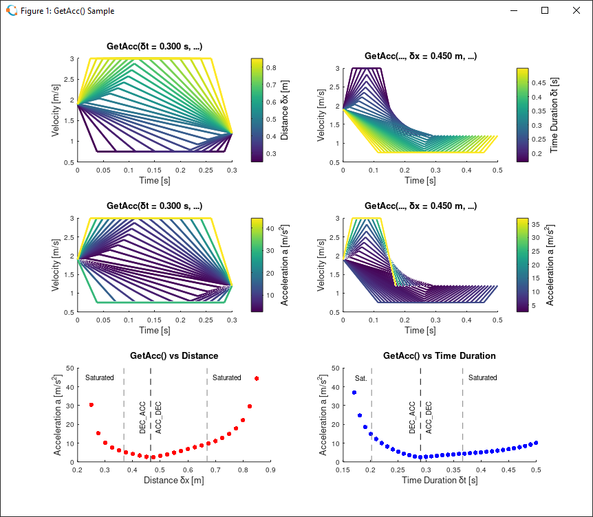

# LibPathPlanOctave

This repository contains functions and scripts to demonstrate the PathPlan library functions. Written in MATLAB, this repository is intended for use with [Octave](https://www.gnu.org/software/octave/index). The repository also serves the development of the PathPlan library.

- Close the repository: `git@github.com:tmatijevich/LibPathPlanOctave.git`
	- Alternative: `ssh://git@ssh.github.com:443/tmatijevich/LibPathPlanOctave.git`
	
## PathPlan (Octave)

Developing the PathPlan library in Octave utilizes the easy plotting and brute-testing capabilities.  
List of functions:
- SecondOrderRoot
- GetAcc
- GetTime
- GetDist
- GetVel
- GetPoint
- GetTimeDiff
- GetAccInTimeDiff
- GetAccInTimeDiffWithRise

Here is a sample for the `GetAcc()` function where the acceleration of a linear motion profile is determined given the time, distance, initial & final velocities, and velocity limits.

Provided a velocity point profile, the `GetPoint()` function will return the position, velocity, and acceleration at an intermediate time value.

