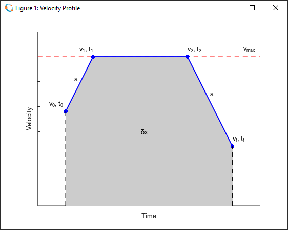
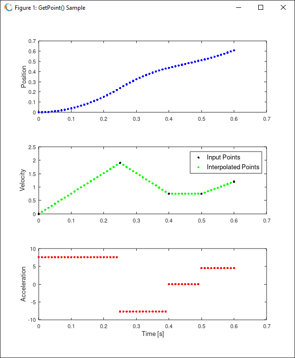

# LibPathPlanOctave

This repository contains functions and scripts to demonstrate the PathPlan library functions. Written in MATLAB, this repository is intended for use with [Octave](https://www.gnu.org/software/octave/index). The repository also serves the development of the PathPlan library.

- Clone the repository: `git@github.com:tmatijevich/LibPathPlanOctave.git`
	- Alternative: `ssh://git@ssh.github.com:443/tmatijevich/LibPathPlanOctave.git`
	
## PathPlan (Octave)

Developing the PathPlan library in Octave utilizes the easy plotting and brute-testing capabilities.

This library assumes:
- Positive distance and velocity.
- Symmetric acceleration and deceleration.
- Zero jerk.

List of functions:
- SecondOrderRoot
	- `r1, r2 = SecondOrderRoot(p2, p1, p0)`
	- Determine the real roots of a second order polynomial (quadratic equation) given the coefficients `p2 * x^2 + p1 * x + p0 = 0`.
- GetAcc
	- `a = GetAcc(dt, dx, v0, vf, vmin, vmax)`
	- Determine the minimum acceleration to move in time over a distance.
- GetTime
	- `dt = GetTime(dx, v0, vf, vmin, vmax, a)`
	- Determine the minimum time to move with acceleration over a distance.
- GetDist
	- `dx = GetDist(dt, v0, vf, vmin, vmax, a)`
	- Determine the maximum distance to move with acceleration in time.
- GetVel
	- `v = GetVel(dt, dx, v0, vf, vmin, vmax, a)`
	- Determine the minimum intermediate velocity to move with acceleration in time over a distance.
- GetPoint
	- `x, v, a = GetPoint(x0, t[i], v[i], n, t*)`
	- Determine the position, velocity, and acceleration at a time point along a velocity point profile.
- GetTimeDiff
	- `tdiff = GetTimeDiff(dx, v0, vf, vmin, vmax, a)`
	- Determine the difference between the time minimizing and time maximizing velocity profiles.
- GetAccInTimeDiff
	- `a = GetAccInTimeDiff(tdiff, dx, v0, vf, vmin, vmax)`
	- Determine the minimum acceleration required to achieve movement extremes within a given time difference.
- GetAccInTimeDiffWithRise
	- `a = GetAccInTimeDiffWithRise(tdiff, dx, v0, vf, vmin, vmax)`
	- Same as `GetAccInTimeDiff`, but also consider an initial rise in velocity from standstill.
	
This library typically describes movement profiles in terms of velocity and time, where position and acceleration can be differentiated and integrated. The velocity profile has an initial and final velocity, as well as an intermediate velocity possibly saturated by the limits.

Here is a sample for the `GetAcc()` function where the acceleration of a linear motion profile is determined given the time, distance, initial & final velocities, and velocity limits.

Provided a velocity point profile, the `GetPoint()` function will return the position, velocity, and acceleration at an intermediate time value.

